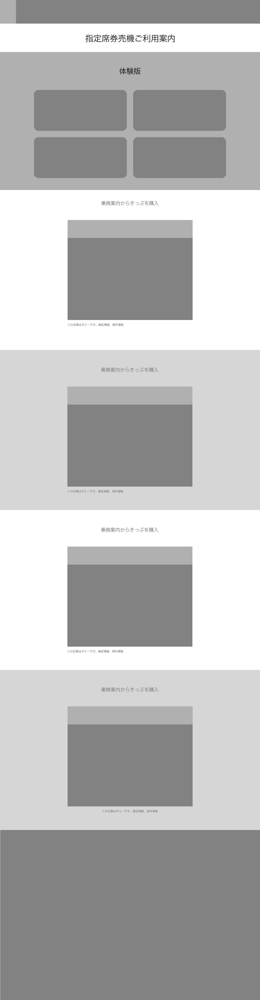

# 職業訓練：クライアントワーク（体感型操作説明ページ）

※ 職業訓練所での実践訓練で製作した仮想クライアントの仮想依頼に対しての提出成果物です。正式プロジェクトではありません。

## 概要

### 依頼内容

- 機器メーカのHPに掲載する、対象機器の操作説明ページ [指定席券売機ご利用案内](https://www.jreast.co.jp/mv-guide/demo/)  の新案ページとして、指定席券売機の操作説明を（モックアップ型）体験型で行うページに改変してほしい。


### 変更前


### 変更後（クライアントワーク）


## ヒアリング

### ヒアリングの際に明確にするべきポイント

| 項目 | 回答 |
|--|--|
| 新規のサイトか既にあるサイトのリニューアルか | 企業HPは既あることを想定。ヘッダー、フッターのレイアウトは既存HPにそって作成すること。 |
| Webサーバーの環境（自前・レンタル・有料・無料） | 自前を想定（提出にはリソース・書類のみで、実装は顧客が行う）<br>[確認環境](https://www.mikuro.works/portfolio/works/experience-based-operation-explanation/)は提供する |
| ドメイン名（有料・無料） | 一部のオリジンのみ新規作成にて考慮なし |
| コンテンツの中身 | __※ あくま試験提出用のなので素材を無断での利用にて著作等の関連より、ページにはベーシック認証を利用し、guestユーザでログインして閲覧可能にする。__<br><br>構成は1ページ（__※画像毎の画面表示は70以上__）<br>■ 指定席券売機ご利用案内<br>① 乗換案内からきっぷを購入<br>② 乗換案内からきっぷを購入（列車を変更する場合）<br>③ 新幹線指定席特急券と乗車券を購入<br>④ Suica定期券を購入<br><br>・以降他のページでも利用できるよなデータを意識したレイアウトをして欲しい。<br>・レスポンシブ対応もしてほしい|
| コンテンツ素材の有無（画像や文章はどうするか） | イメージや文言はそのまま既存画像を流用し加工する |
| パソコンユーザー、スマートフォンユーザーの比率 | 1:1 |
| ターゲットとなるユーザーのペルソナ | ① まだ指定席券売機を要したことがない一般の方が前もって利用方法を確認するために閲覧。<br>② 出張先などで定期券更新方法などを前もって確認ようとする利用者 |
| SNSとの連動 | Twitterでハッシュタグを「#架空企業」として、さらにプロフィール、ツイートに「架空企業」と掲載 |
| アップロード後の保守・管理 | なし |
| デザインの参考サイトやベンチマーク（ライバル的）サイトはあるか？ | https://www.eki-net.com/travel/guide/payment/mv.html　動画が目的を果たしている |
| 公開希望予定日 | 3月19日 |


### サイトにのせるコンテンツ

- 指定席券売機ご利用案内（１ページ：遷移画面数は70枚以上です）
  1. 乗換案内からきっぷを購入  
  2. 乗換案内からきっぷを購入（列車を変更する場合）  
  3. 新幹線指定席特急券と乗車券を購入  
  4. Suica定期券を購入  

### クライアントの情報

| 項目 | 内容 |
| --- | --- |
| 企業名 | JR東日本 |
| 業種 | 鉄道 |
| クライアントの特徴 | |
| 住所 | |
| ターゲットを決める | 指定席券売機よりチケットを購入しようと前もって確認している利用者|
| 参考サイト |  |


## 要件定義
### プロジェクト概要

| 項目 | 内容 |
| --- | --- |
| サイトの概要（どういったサイトを作るか） | 操作パネルを操作し画面遷移しているような体感型のマニュアル |
| クライアントの情報 |  |
| クライアントの要望 | ・以降他のページでも利用できるよなデータを意識したレイアウト・データの管理をして欲しい。<br>・レスポンシブ対応もしてほしい |

### システム部分
| 項目 | 内容 |
| --- | --- |
| 新規or改修 | 既存ページの改修 |
| 新規の場合、サーバー・ドメインをどうするか | 既存への修正にてなし |
| 改修の場合はサーバーのFTP情報の確認 | 修正作業は顧客で実施するので、試験・確認用環境とリソースの提供のみ。[確認用環境](https://www.mikuro.works/portfolio/works/experience-based-operation-explanation/) |
| 埋め込むSNSの有無 | なし |
| お問い合わせフォームの必要性 | なし |
| 作業のタイムスケジュール | 1. 技術調査<br>2. 2/18 カンプ提出・制作開始<br>3. 2/25 テスト<br>4. 3/22 提出・顧客による受け入れテスト<br>5. 3/19 公表 |

### デザイン部分

| 項目 | 内容 |
| --- | --- |
| メインターゲット | 指定席券売機よりチケットを購入しようと前もって確認している利用者　|
| おおまかなデザインコンセプト | （モックアップ型）体験型の定席券売機の操作説明ページ |
| コーポレートカラーの有無 | #008803 |
| 出版物や販促物などの有無 | なし |
| 画像・文章の確認 | 既存画像を利用するが、押下するボタンなどの対象となる部分の画像加工は必要 |
| 参考にしたいサイト |  |

### サイト情報・構成

| 項目 | 内容 |
| --- | --- |
| サーバー・ドメイン・サイトマップ | なし |
| 各ページのコンテンツ | [サイトにのせるコンテンツ](#サイトにのせるコンテンツ)を参照 |
| ターゲットとなるユーザー | 指定席券売機よりチケットを購入しようと前もって確認している利用者 |

### デザインコンセプト
|  |  |
| --- | --- |
| カラーマネジメント | メインカラー #008803 ベースカラー #ffffff |
| フォント | |
| メインビジュアル | |

### 各ページのワイヤーフレーム



## （要件を満たすための）実現方法と調査

### JSON - 画面遷移の制御やメンテンスのため、画面コンテンツデータに関して

- aJaxでの非同期通信にて取得
- 画面遷移時に取得する画像データの扱い方  
以下の方法で、実際に数画面遷移するサンプルを作成してみてどの方法を採用するか検討する。
  - ページ読み込み時に全ての画像情報に関しては読み込んでおき
    - 「方法１」：  ~~一つの画面要素で構成し、area領域をクリックした時に以下の値を書き換える方法（areaのhrefに関しては#で固定）~~  イメージマップではareaにCSSで定義しても、ホバー時のハイライト処理などのできない。よって、方法１、２は却下。
    - 「方法２」：  ~~一度全ての画面要素をHTML化し、カレントの画面以外はdisplay none (visibility: hidden)で対応。~~  
    ~~area領域をクリックした時に、displayプロパティまたは、 visibilityプロパティを切り替える。~~ 
    - 「方法３」： 一つの画面要素で構成し、一つ上のレイヤー（position: absolute、z-index）にarea座標を指定したオブジェクトをおき、クリックイベントで画面の各値を変更する。
    - 「方法４」：一度全ての画面要素をHTML化し、カレントの画面以外はdisplay none (visibility: hidden)で対応。
    一つ上のレイヤー（position: absolute、z-index）にarea座標を指定したオブジェクトをおき、クリックイベントでした時に、displayプロパティまたは、 visibilityプロパティを切り替える。
- 画面表示領域の要素に、それぞれtitleID（購入方法別）、画像にscreenID（画面の識別）ID値をに付与し管理する。
- 各スクリーンにはボタンがいくつか存在し、そのボタンの位置を元画面画像のサイズに合わせた座標をcoords値として設定する。 


### 各画面のボタンの構成と座標位置
元画像で以下の座標を調査し。

- rect : 頂点1のx座標, 頂点1のy座標, 頂点2のx座標, 頂点2のy座標
- circle : 円の中心のx座標, 円の中心のy座標, 円の半径
- poly : x,yの組のセットを好きな数だけ並べる

### 各画面のボタンのレスポンシブ対応
表示する画像の表示幅と元幅を計算し、表示位置・大きさを算出する。

### ボタンのホバー時の処理   
従来のイメージマップの場合、areaの枠を消すCSSは適用できるがその他は不可だった。  
よって上記「方法１」、「方法２」の実装は断念

## 実装

以下の方法で実装する

### 利用技術
- HTML
- CSS
- JSON
- JavaScript

- rwdImageMapsなどでイメージマップのレスポンシブ化可能だが、ネイティブのJavaScriptでの表示制御を行うため、できるだけjQuery利用を避けたい。

### 実現方法
- 画面は最初にメニューした時、モーダル表示で実装する
- CSS でボタン等のハイライト表示やアニメーション処理を行う。
- 画面遷移については、あくまでページ内のコンテンツ内での仮想的な画面遷移のため、ページ自体の（SPA）画面遷移のようなヘッダー情報の書き換えや、ロードしたコンテンツに再度Loadイベント時の処理を付与する等の必要はない。
- ~~SpeechAPIを利用して音声案内を同時に展開できないか検討する。~~

### データの取得と作りこみで利用技術
- Python
- BeautifulSoup
- json
- requests

## JSONデータ
操作説明での画面遷移のための情報をJSONで管理し、このページではそのデータを取得してコンテンツを生成する。

### JSONデータの仕様


### JSONデータのサンプル

```
{
  "displayAreas": [
    {
      "titleID": "timetable01",
      "title": "乗換案内からきっぷを購入",
      "description" : "高崎から山寺までの列車を発時刻で検索して、新幹線指定席特急券、片道乗車券を購入してみましょう。",
      "screens" : [
        {
          "screenId" : "screen01",
          "caption" : "STEP1",
          "description" : "ご希望のボタンを選びます",
          "supplementaryExplanation" : "",
          "imageUrl" : "img/timetable_slide01.png",
          "buttons": [
            {
              "shape": "rect",
              "screenTransitionDestination": "screen02",
              "coords": [660, 177, 1204, 365]
            }
          ]
        },
        {
          "screenId" : "screen02",
          "caption" : "STEP2",
          "description" : "到着駅を選択します。",
          "supplementaryExplanation" : "出発駅は現在地、利用日時は現在時刻があらかじめ入力されていますが、変更することも可能です。変更する場合は、それぞれの「変更する」ボタンにタッチします。",
          "imageUrl" : "img/timetable_slide02.png",
          "buttons": [
            {
              "name": "next",
              "shape": "rect",
              "screenTransitionDestination": "screen03",
              "coords": [1070, 324, 1198, 391, 20]
            },
            {
              "name" : "cancel",
              "shape": "circle",
              "screenTransitionDestination": "screen00",
              "coords": [67, 957, 58]
            },
            {
              "name": "previous",
              "shape": "rect",
              "screenTransitionDestination": "screen01",
              "coords": [160, 939, 328, 1011, 16]
            }
          ]
        },
      ]
    }
  ]
}

```


### JSONデータの作成

[指定席券売機ご利用案内](https://www.jreast.co.jp/mv-guide/demo)  

#### 上記サイトより以下をjupyter-notebookにて実行し利用し取得する。
リンクとなるボタンはダミーとして１つだけ設定


```python downloadToJson.py
import requests
from bs4 import BeautifulSoup
import json
from collections import OrderedDict
import pprint

url = 'https://www.jreast.co.jp/mv-guide/demo/'
res = requests.get(url)
res.encoding = res.apparent_encoding
soup = BeautifulSoup(res.content, 'lxml')

sectionElements = soup.select('section.pb100')
displayAreas = []
titleCnt = 0
for sectionElm in sectionElements:
    displayArea = {}
    # displayArea = OrderedDict()
    titleCnt = titleCnt + 1
    displayArea['titleID'] = 'title{:0=2}'.format(titleCnt)
    displayArea['title'] = sectionElm.select_one('h3').text
    try:
        displayArea['description'] = sectionElm.select_one('p.mb50').text
    except AttributeError:
        displayArea['description'] = ''
    
    screenElements = sectionElm.select('li.swiper-slide')
    screens = []
    cnt = 0
    for screen in screenElements:
        cnt = cnt + 1
        screenObj = {}
        screenObj['screenID'] = 'screen{:0=2}'.format(cnt)
        screenObj['caption'] = screen.select_one('dt.step').text 
        screenObj['description'] = screen.select_one('dd.stepTxt').text
        try:
            screenObj['supplementaryExplanation'] = screen.find(class_='text').text
        except AttributeError:
            screenObj['supplementaryExplanation'] = ''
        screenObj['imageUrl']  = screen.select_one('img')['src']
        buttonObj = {}
        buttonObj['name'] = ''
        buttonObj['shape'] = ''
        buttonObj['screenTransitionDestination'] =  'screen{:0=2}'.format(cnt + 1)
        buttonObj['coords'] = []
        screenObj['buttons'] = []
        screenObj['buttons'].append(buttonObj)
        screens.append(screenObj)

    displayArea['screens'] = screens
    displayAreas.append(displayArea)

hage =  json.dumps(displayAreas, indent=2, ensure_ascii=False)
print(hage)
# pprint.pprint(hage)

```

実行

```
python3 text.py > a.json
```


[実行結果](testpage/a.json)

```python downloadImage.py
[
  {
    "titleID": "title01",
    "title": " 乗換案内からきっぷを購入",
    "description": "高崎から山寺までの列車を発時刻で検索して、新幹線指定席特急券、片道乗車券を購入してみましょう。",
    "screens": [
      {
        "screenID": "screen01",
        "caption": "STEP1",
        "description": "ご希望のボタンを選びます。",
        "supplementaryExplanation": "",
        "imageUrl": "img/timetable/timetable_slide01.png",
        "buttons": [
          {
            "name": "",
            "shape": "",
            "screenTransitionDestination": "screen02",
            "coords": []
          }
        ]
      },
      ・・・・・・以下省略
      t

```
### スクレイピングで得た情報をJSONに加工する

各画像からcoordsの値を割り出し、それぞれbutton情報をJSONファイルに追加する。

例：抜粋
```
          "buttons": [
            {
              "shape": "rect",
              "screenTransitionDestination": "screen02",
              "coords": [660, 177, 1204, 365]
            }
```

## 画像データ

### pythonよりスクレイピングダウンロード

 jupyter-notebookで以下を実行するか、またはスクリプトファイルをpythonで実行する。

```
from pathlib import Path
import requests
from bs4 import BeautifulSoup
import urllib
import time


loadUrl = 'https://www.jreast.co.jp/mv-guide/demo/'
html = requests.get(loadUrl)
soup = BeautifulSoup(html.content, 'lxml')
# print(soup)

outFolder = Path('download')
outFolder.mkdir(exist_ok=True)

for image in soup.select('img'):
    imageUrl = urllib.parse.urljoin(loadUrl, image['src'])
    imageData = requests.get(imageUrl)
    filename = imageUrl.split('/')[-1]
    
    outPath = outFolder.joinpath(filename)
    print(outPath)
    with open(outPath, mode='wb') as f:
        f.write(imageData.content)
    time.sleep(1)
```

実行
```
python3 download.py
```

実行結果（コンソール出力）
```
download/kenbaiki.png
download/timetable_slide01.png
download/timetable_slide02.png
download/timetable_slide03.png
download/timetable_slide04.png
download/timetable_slide05.png
download/timetable_slide06.png
download/timetable_slide07.png
download/timetable_slide08.png
download/timetable_slide09.png
download/timetable_slide10.png
download/timetable_slide11.png
download/timetable_slide12.png
download/timetable_slide23.png
download/timetable_slide24.png
download/timetable_slide01.png
download/timetable_slide02.png
download/timetable_slide03.png
download/timetable_slide04.png
download/timetable_slide05.png
download/timetable_slide06.png
download/timetable_slide0702.png
download/timetable_slide14.png
download/timetable_slide15.png
・・・・・　省略　・・・・・
download/net_slide07.png
download/ico_pagetop.svg
```
## 実装 環境構築
- AWS S3 : 静的コンテンツをサーバレスで提供
- AWS CloudFront : CDNとしてキャッシング
- AWS Route 53 : ドメインへのマッピングと、CloudFront経由でS3へのルーティング
- AWS Lambda : サーバレスにてBasic認証等の実装


## 制作時間

| 項目 | 時間 | 
|---|---| 
| total | 33時間 | 
| 構想と仕様決定 | 4時間 |
| 調査 | 8時間 |
| デザインカンプ | 2時間 |
| データ取得用コーディング | 20分(画像5分、情報＋JSON化15分) |
| データ取得後のJOSN加工 | 3時間 |
| 画像加工 | 3時間 |
| コーディング | 13時間 |
| コーディング（既存レイアウトの模倣） | 4時間 |
| 確認用AWS環境構築とデプロイ作業| 30分|</p>

## 実装で苦しんだところ

### 『画面遷移時に取得する画像データの扱い方』の実装に苦労した。
70枚の画像全ての元画像の中に、押下するべきボタンの周りに色枠が描きこんであり、それらを消す作業に時間がかかった。また、押下するボタンの座標時間もそれなりの作業時間が必要となった。

### 非同期通信での取得したデータの扱いです。
XMLHttpRequest、Fetchのとちらにしろ、非同期通信の場合には、「その取得データ取得と取得後の表示を（DOMに）反映するまでの一連の処理は同じタイミング（コールバックも含めて、同じ処理スコープ内）で全てお行わないとトラブルになる。」ということの体得に苦労しました。  
他のタイミングで利用する場合は、Web Storate APIを利用するなどでシリアライズするか、一旦DOMに反映してそれを利用するかのような回避策もあることも分かりました。  

今回は、JSONデータを一括取得して画像データだけ都度サーバより取得するような感じで実装しました。  
本来は非同期通信でWebAPI経由でJSONを取得して、必要な分を得た方がスマートだと思います。
ですが、一括で必要なリソースを取得してDOM生成し（DOM生成時に全ての画像をダウンロードする？）、必要な要素以外を非表示とする手法も捨て難いです。

### プロトタイプベースのオブジェクト指向
JavaScriptはプロトタイプベースのオブジェクト指向プログラミング言語です。
去に学んだ、オブジェクト指向プログラミングはそのほとんどは、クラスベースオブジェクト指向言語であったため、コーディングすればするほど混乱を招いた。  
コンストラクタはインスタンス変数が使えてしまうように見えるし、メソッドのオーバーロードは行えないなど、非常に考え方に苦労しました。  
結局９割以上コーディングを終えた時点でJavaScriptでのClassはシンタックスシュガー（糖衣構文）であることが分かり、クラス自体は存在しないことがわかった（結局はオブジェクト（連想配列とプロトタイプ））

### this
従来の関数とアロー関数内、クラスメソッドのthisはそれぞれ違うということに気付くのに2日かかりました。


## 課題作成理由

このページで実現していることは、プレゼンテーションアプリなどでも、ハイパーリンクで画面遷移を表現することは可能ですが、競争が激しい切磋琢磨されたブラウザの描画速度は高く、ウェブでのマニュアル制作のメリットは高いと思います。

スマートフォンやPCのアプリは勿論、券売機、ATM、セルフPOSなどの画面操作について迷う方が多いそうです。  
ヘルプ機能を利用することも可能ですが、体験による操作慣れもやはり必要です。
実機で体験することが一番ですが、ウェブから擬似的に経験をすることで、物理的制約から解放されるメリットは大きいと思います。

また、エンドユーザが使うこと以外にも、教育モードや保守モードなど、同じユーザインターフェースを利用して実装されることも多く、この操作マニュアルにも利用できると考えています。
ユーザサポートのコールセンター・ヘルプデスク部門や、機器保守員のサポートなどのテクニカルサポート部門では日々これらの操作説明を行なっていることと思います。 
このとき、実機での操作を想定すると実機の確保や、そのメンテナンス教育コストもかかります。  
即座にブラウザで疑似操作体験しながら説明でき、実機の用意や場所へ移動するなどの無駄を大幅に削減することが可能です。

さらに、操作しているときに実機では表示しない情報などを画面欄外に表示することで、付加情報を与えることが可能です。

あと、職業訓練ですので、簡易的なウェブアプリを作る課題として最適だと思いました。
ユーザ認証やセッション制御を抜いた、JavaScriptを使う上で最低限必要な知識が網羅されていると感じました。


## 今後
JOSNデータを製作中に思ったのですが、画面遷移情報を作成するアプリを作れば、他のページに簡単に流用できるので、社内などで操作マニュアル作成にそのまま使えることが可能と思います。
時間があればこれらの制作にあたり、一つのサービスとして提供することも考えています。        
